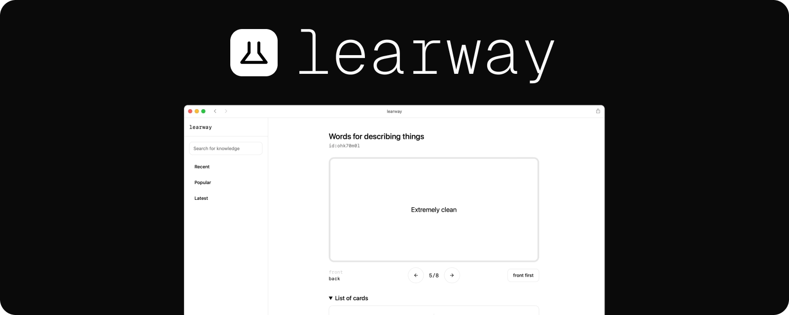
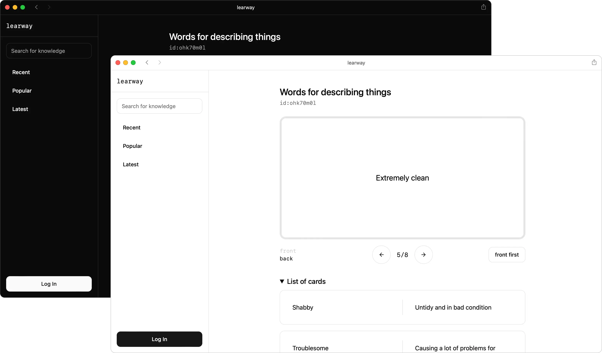
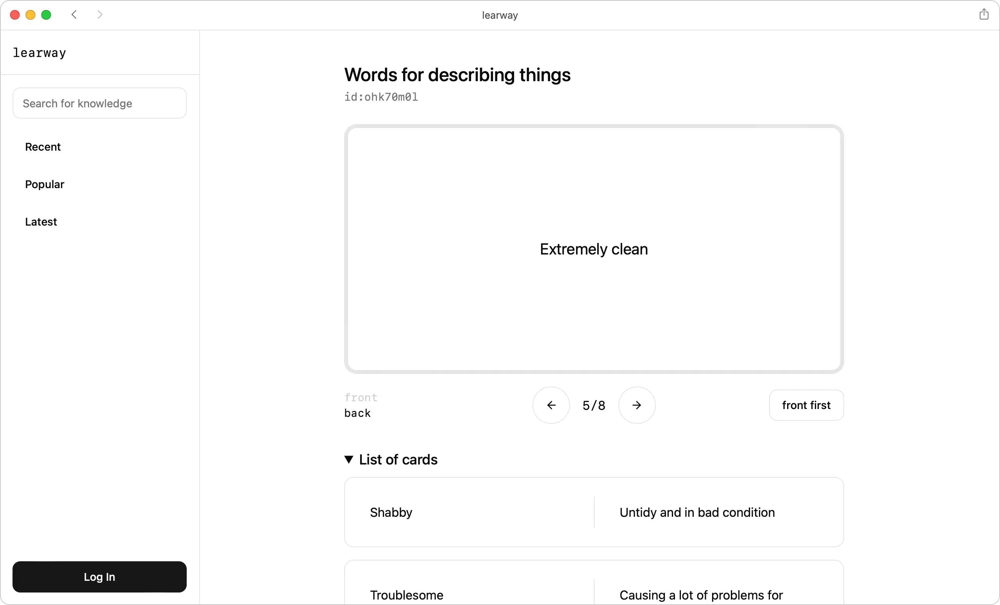
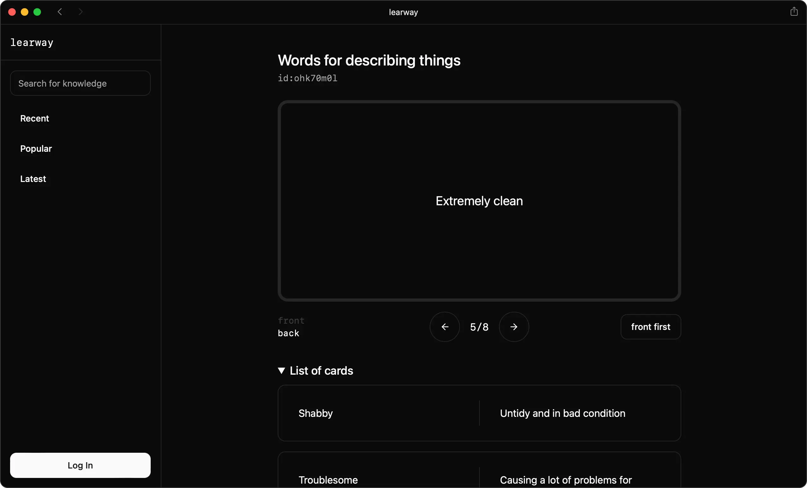

> WIP! Project is still in early stage of development

# What is learway?

learway is user-friendly flashcard-based learning platform. It allows to look for, create and share flashcard decks to expand your knowledge.

# Preview



<details>
<summary>Light</summary>

</details>
<details>
<summary>Dark</summary>

</details>

# Technologies

Server: `Go`, `SQLite`

Webapp: `SvelteKit`

Currently learway consists of API server (Backend) and SPA web app (Frontend). Backend written in Go with Echo framework and SQLite as database. Web app uses SvelteKit with static adapter which allows to build it into static files. These built files are then embedded into a single binary and served alongside the API.

# App

After building the project (or downloading prebuilt), you will get a single binary. By itself it is a CLI app which allows you to manage how learway service will be served.

For now there are three commands available

```bash
# Serve API with web app
learway serve

# Seeds database with mock data
learway seed

# Serve API in development suitable environment
learway dev
```

In the development environment, CORS is enabled and static files are not served. The frontend is expected to run separately using `npm run dev`. This setup allows hot reloading and facilitates easier debugging of the frontend application
